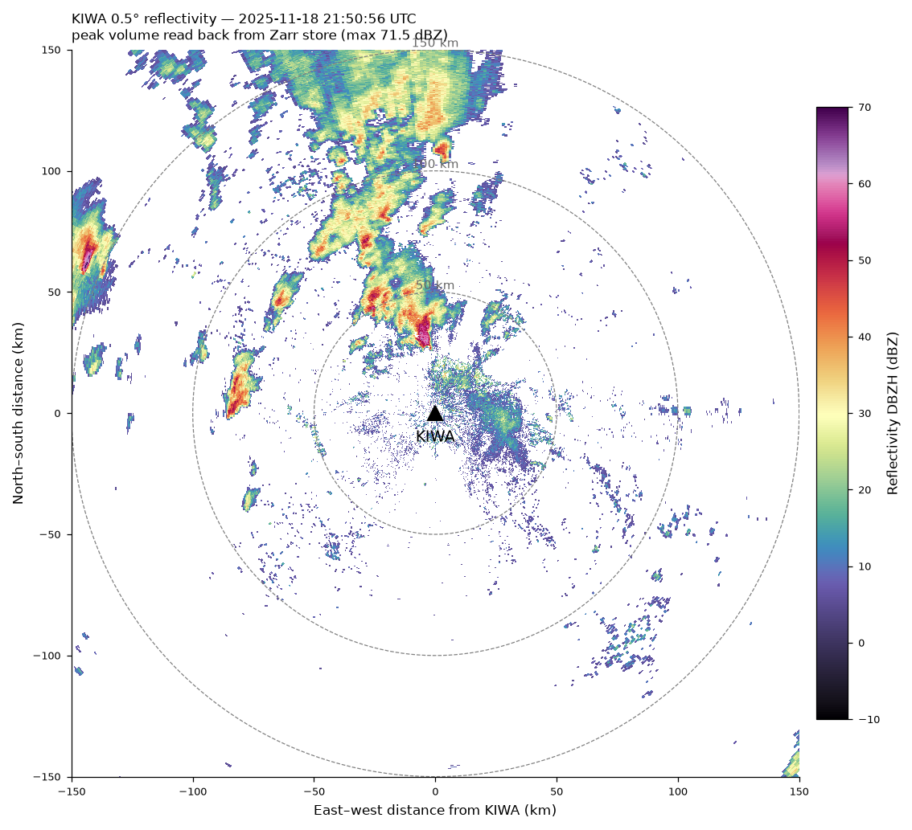
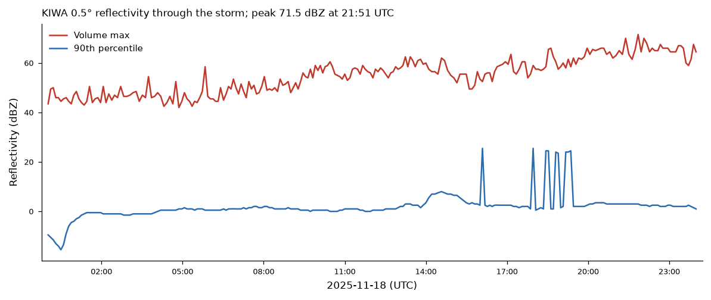
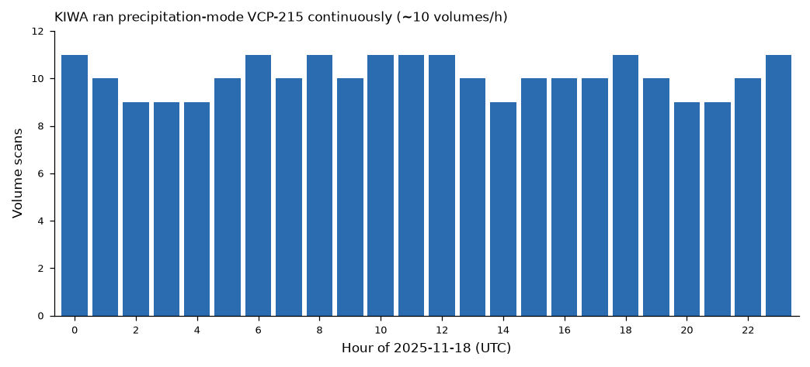

# NEXRAD Level II → Zarr : KIWA, 18 Nov 2025 storm

A reusable workflow that converts a list of NEXRAD WSR-88D Level II volume
scans into a single, consolidated, time-appended **Zarr** store, using
[xradar](https://docs.openradarscience.org/projects/xradar/) with a
[Py-ART](https://arm-doe.github.io/pyart/) fallback.

## Installation

Reproduce the exact environment the KIWA store was built in:

```bash
conda env create -f environment.yml   # creates the `radar` env, pinned versions
conda activate radar
```

Or install the Python dependencies with pip into an existing env:

```bash
pip install -r requirements.txt
```

The `conda` route is recommended — the compiled stack (cartopy, netCDF4) resolves
more reliably from `conda-forge`. `cmweather` (the ChaseSpectral colormap) is
pip-only and is pulled in by both routes.

## Why this is not a one-liner

NEXRAD radars run *adaptive* volume-coverage patterns. Within a single VCP the
number and position of elevation sweeps changes volume to volume, so the same
sweep *index* does not mean the same elevation angle across time:

| Mechanism | Effect on the sweep list |
|-----------|--------------------------|
| **AVSET** | High tilts are dropped when there is no echo aloft — a quiet volume may have 14 sweeps, an active storm volume 20. |
| **SAILS / MRLE** | Extra low-level base tilts are inserted at *variable* index positions mid-volume. |
| **Split cuts** | The 3 lowest tilts are scanned twice: a long-range *surveillance* cut carrying the polarimetric moments (DBZH, ZDR, PHIDP, RHOHV, CCORH) and a *Doppler* cut carrying VRADH, WRADH. |

For KIWA on 2025-11-18 the radar ran **VCP-215 (SAILS×1)** continuously, and the
observed sweep count ranged **14 → 20** across the day.

## Normalization strategy

Every volume is snapped onto a fixed **canonical** layout keyed by *fixed
elevation angle*, not sweep index:

1. **15 canonical angles**: 0.5, 0.9, 1.3, 1.8, 2.4, 3.1, 4.0, 5.1, 6.4, 8.0, 10.0, 12.0, 14.0, 16.7, 19.5°.
2. **Merge split cuts** — at each low tilt, the surveillance sweep supplies the dual-pol moments and its Doppler partner supplies VRADH/WRADH; the longer-range (surveillance) DBZH wins.
3. **Drop SAILS duplicates** — the first occurrence of each canonical angle is kept.
4. **Fixed grids** — each sweep is reindexed onto a fixed azimuth grid (720 rays for the 3 lowest super-res tilts, 360 otherwise) and a fixed 250 m range grid, so every volume aligns exactly on append.
5. **AVSET fill** — canonical tilts missing from a volume are written as all-NaN, so every volume has the same 15 sweeps.

## Store layout

```
kiwa_20251118.zarr
  /sweep_0 … /sweep_14          one group per canonical elevation
      dims:   (volume_time, azimuth, range)
      vars:   DBZH VRADH WRADH ZDR PHIDP RHOHV CCORH   (float32)
      coords: volume_time, azimuth, range,
              sweep_fixed_angle, latitude, longitude, altitude
```

`volume_time` carries CF units `seconds since 1970-01-01` (pinned so that Zarr
appends don't drift the encoded dates). Metadata is consolidated for fast
opening.

## Usage

```python
import nexrad_to_zarr as n2z

# scan_list: [{"key": <s3 key>, "timestamp": <pandas Timestamp>}, ...]
# e.g. from the nexrad-site-rainfall skill:
#   keys = list_scan_keys("KIWA", "2025-11-18 00:00", "2025-11-19 00:00")

summary = n2z.build_zarr_store(keys, "kiwa_20251118.zarr",
                               download_workers=10)
print(summary["n_written"], "volumes;", summary["readers"])
```

Streaming: each scan is downloaded to `scratch/`, read, written, then deleted,
so the full archive is never held on disk at once. Downloads are prefetched on
a thread pool while the current volume is written.

## Opening the store

```python
import xarray as xr
ds0 = xr.open_zarr("kiwa_20251118.zarr", group="sweep_0")   # lowest tilt
# or the whole tree:
from datatree import open_datatree            # or xarray.open_datatree
dt = open_datatree("kiwa_20251118.zarr", engine="zarr")
```

## Read-back, QC & plotting helpers

The module also ships convenience helpers that read *from* the store:

```python
import nexrad_to_zarr as n2z

n2z.open_sweep("kiwa_20251118.zarr", sweep=0)   # one canonical sweep as a Dataset

qc = n2z.qc_report("kiwa_20251118.zarr")        # per-sweep coverage table
#   sweep  fixed_angle  n_vol  naz  nrng  vol_with_DBZH_frac

# Cartesian-km PPI straight from the store. volume_time=None picks the
# volume with the highest DBZH on that sweep (the storm peak).
meta = n2z.plot_ppi("kiwa_20251118.zarr", "kiwa_ppi_peak.png",
                    volume_time=None, sweep=0, moment="DBZH")
# -> meta = {"volume_time": "2025-11-18T21:50:56", "fixed_angle": 0.5,
#            "lat": 33.289, "lon": -111.670, "max": 71.5}
```

`plot_ppi` uses a plain Cartesian axis (east-west / north-south km from the
radar) rather than a cartopy GeoAxes — the large super-resolution pcolormesh
renders reliably that way. `ppi_from_store` returns the raw `(X_km, Y_km,
field, meta)` if you want to build your own figure.

## Results (KIWA, 2025-11-18)

The workflow was run end-to-end on the full UTC day. 242/242 volumes were
written (233 read by xradar, 9 via the Py-ART fallback), producing a 2.4 GB
consolidated store with 15 canonical sweep groups.

Peak-volume reflectivity (0.5deg, 21:50:56 UTC, 71.5 dBZ), read back *from the
Zarr store*:



Storm evolution (0.5deg volume-max and 90th-percentile reflectivity):



Scan cadence — VCP-215 ran continuously at ~10 volumes/hour:



QC tables (`qc/`) confirm the expected AVSET signature: 100% DBZH coverage at
the lowest tilt tapering to 14% at 19.5deg. Provenance for the run is in
`build_summary.json` and the scan list in `scan_catalog.csv`.

## Data source & caveats

* Volumes stream **unsigned** from the public `unidata-nexrad-level2` S3 bucket.
* Values are as-recorded moments — **not** gauge-calibrated or QC'd. DBZH may
  include ground clutter / AP; use RHOHV and CCORH to screen non-meteorological
  echo.
* The Py-ART fallback handles the small fraction of volumes whose split-cut
  layout xradar cannot reconcile; those volumes are read and normalized
  identically.
