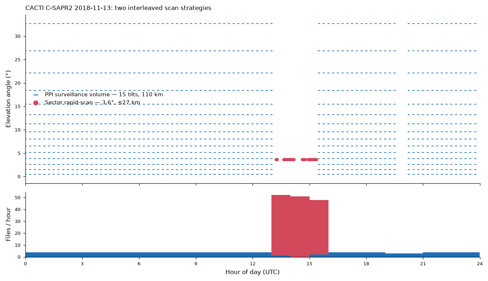
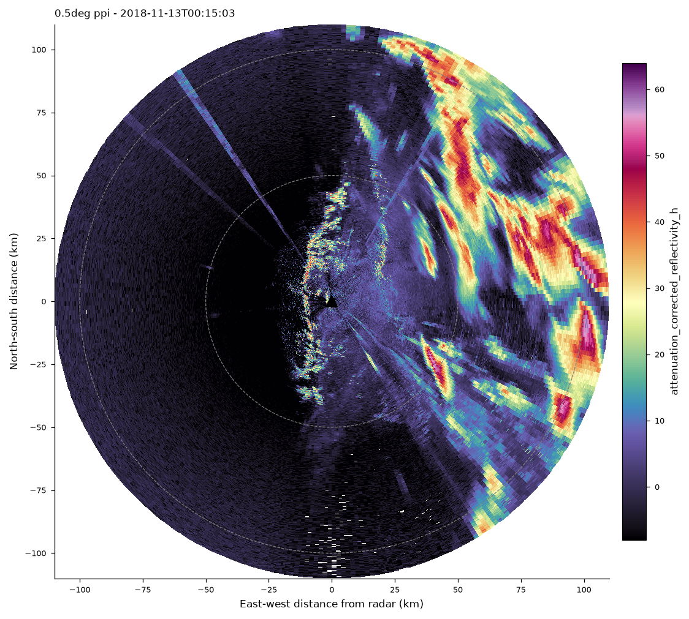
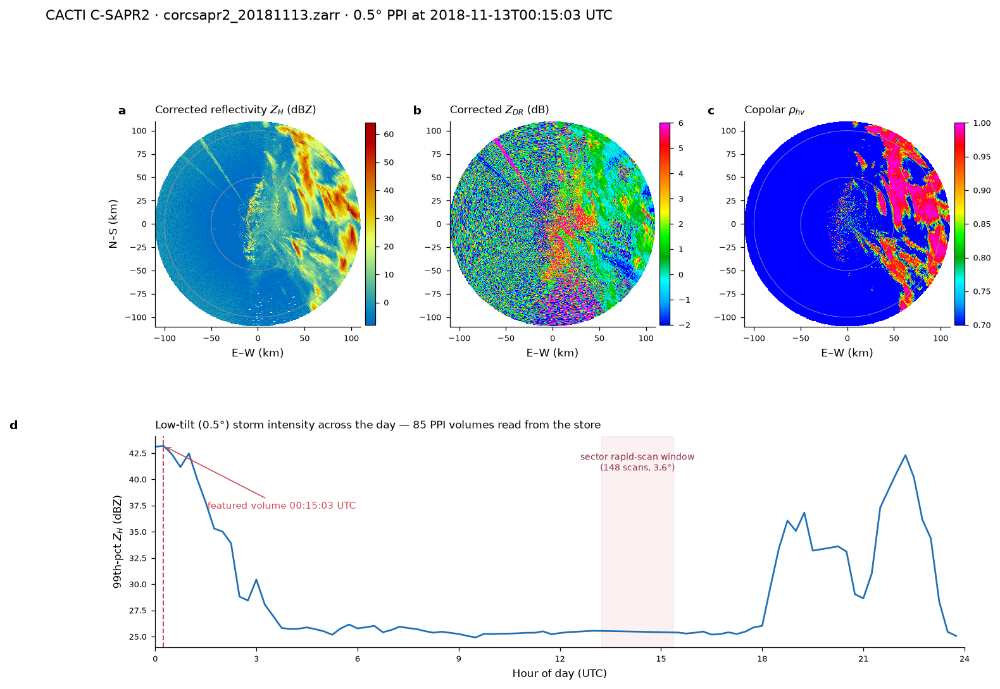

# Radar volumes → Zarr

Reusable workflows that turn a day of single-volume radar files into one
consolidated, time-appended **Zarr** store you can slice, subset, and plot
from — built on [xradar](https://docs.openradarscience.org/projects/xradar/)
with a [Py-ART](https://arm-doe.github.io/pyart/) fallback.

The repository carries **two worked examples** that share one core pattern but
solve different normalization problems:

| Module | Radar | Source | The hard part |
|--------|-------|--------|---------------|
| [`nexrad_to_zarr.py`](nexrad_to_zarr.py) | NEXRAD WSR-88D (KIWA) | Level II, AWS S3 | *adaptive VCP* — sweep count changes volume to volume (AVSET / SAILS / split cuts) |
| [`arm_cfradial_to_zarr.py`](arm_cfradial_to_zarr.py) | ARM C-SAPR2 (CACTI) | CfRadial-1 `b1`, ARM Live | *two interleaved scan strategies* in one day (PPI survey + sector rapid-scan) |

## The shared pattern

Both radars produce a stream of single-volume files that you want as one
analysis-ready cube. The steps that are the same in both modules:

1. **Reindex every sweep onto a fixed azimuth (and range) grid** so volumes
   align exactly on append — a source sweep with 357, 360, or 361 rays and a
   fractional start angle is snapped to a canonical grid; unilluminated bins
   become NaN.
2. **Pin the `volume_time` CF encoding** to a fixed epoch
   (`seconds since 1970-01-01`). Without this, xarray re-derives
   `seconds since <first value>` on the first write and later appends *drift the
   encoded dates* — a 15-minute-later volume can be written 15 days later.
3. **Stream one volume at a time**, appending along a new `volume_time`
   dimension, so the full archive is never held in memory at once.
4. **Read / QC / plot straight from the store** with the module's `open_sweep`,
   `qc_report`, `ppi_from_store`, and `plot_ppi` helpers.

Where the two diverge is *what "aligned" means*. NEXRAD normalizes onto
canonical **elevation angles** in a single sweep tree; ARM's CACTI day splits
into **two group trees** because it interleaves two incompatible strategies
(details below). Each module is standalone — pick the one that matches your
source.

## Installation

Reproduce the exact environment the KIWA store was built in:

```bash
conda env create -f environment.yml   # creates the `radar` env, pinned versions
conda activate radar
```

Or install the Python dependencies with pip into an existing env:

```bash
pip install -r requirements.txt
```

The `conda` route is recommended — the compiled stack (cartopy, netCDF4) resolves
more reliably from `conda-forge`. `cmweather` (the ChaseSpectral colormap) is
pip-only and is pulled in by both routes.

---

# Example 1 — NEXRAD / KIWA (adaptive VCP)

A workflow that converts a list of NEXRAD WSR-88D Level II volume scans into a
single time-appended Zarr store. Module: [`nexrad_to_zarr.py`](nexrad_to_zarr.py).

## Why this is not a one-liner

NEXRAD radars run *adaptive* volume-coverage patterns. Within a single VCP the
number and position of elevation sweeps changes volume to volume, so the same
sweep *index* does not mean the same elevation angle across time:

| Mechanism | Effect on the sweep list |
|-----------|--------------------------|
| **AVSET** | High tilts are dropped when there is no echo aloft — a quiet volume may have 14 sweeps, an active storm volume 20. |
| **SAILS / MRLE** | Extra low-level base tilts are inserted at *variable* index positions mid-volume. |
| **Split cuts** | The 3 lowest tilts are scanned twice: a long-range *surveillance* cut carrying the polarimetric moments (DBZH, ZDR, PHIDP, RHOHV, CCORH) and a *Doppler* cut carrying VRADH, WRADH. |

For KIWA on 2025-11-18 the radar ran **VCP-215 (SAILS×1)** continuously, and the
observed sweep count ranged **14 → 20** across the day.

## Normalization strategy

Every volume is snapped onto a fixed **canonical** layout keyed by *fixed
elevation angle*, not sweep index:

1. **15 canonical angles**: 0.5, 0.9, 1.3, 1.8, 2.4, 3.1, 4.0, 5.1, 6.4, 8.0, 10.0, 12.0, 14.0, 16.7, 19.5°.
2. **Merge split cuts** — at each low tilt, the surveillance sweep supplies the dual-pol moments and its Doppler partner supplies VRADH/WRADH; the longer-range (surveillance) DBZH wins.
3. **Drop SAILS duplicates** — the first occurrence of each canonical angle is kept.
4. **Fixed grids** — each sweep is reindexed onto a fixed azimuth grid (720 rays for the 3 lowest super-res tilts, 360 otherwise) and a fixed 250 m range grid, so every volume aligns exactly on append.
5. **AVSET fill** — canonical tilts missing from a volume are written as all-NaN, so every volume has the same 15 sweeps.

## Store layout

```
kiwa_20251118.zarr
  /sweep_0 … /sweep_14          one group per canonical elevation
      dims:   (volume_time, azimuth, range)
      vars:   DBZH VRADH WRADH ZDR PHIDP RHOHV CCORH   (float32)
      coords: volume_time, azimuth, range,
              sweep_fixed_angle, latitude, longitude, altitude
```

`volume_time` carries CF units `seconds since 1970-01-01` (pinned so that Zarr
appends don't drift the encoded dates). Metadata is consolidated for fast
opening.

## Usage

```python
import nexrad_to_zarr as n2z

# scan_list: [{"key": <s3 key>, "timestamp": <pandas Timestamp>}, ...]
# e.g. from the nexrad-site-rainfall skill:
#   keys = list_scan_keys("KIWA", "2025-11-18 00:00", "2025-11-19 00:00")

summary = n2z.build_zarr_store(keys, "kiwa_20251118.zarr",
                               download_workers=10)
print(summary["n_written"], "volumes;", summary["readers"])
```

Streaming: each scan is downloaded to `scratch/`, read, written, then deleted,
so the full archive is never held on disk at once. Downloads are prefetched on
a thread pool while the current volume is written.

## Opening the store

```python
import xarray as xr
ds0 = xr.open_zarr("kiwa_20251118.zarr", group="sweep_0")   # lowest tilt
# or the whole tree:
from datatree import open_datatree            # or xarray.open_datatree
dt = open_datatree("kiwa_20251118.zarr", engine="zarr")
```

## Read-back, QC & plotting helpers

The module also ships convenience helpers that read *from* the store:

```python
import nexrad_to_zarr as n2z

n2z.open_sweep("kiwa_20251118.zarr", sweep=0)   # one canonical sweep as a Dataset

qc = n2z.qc_report("kiwa_20251118.zarr")        # per-sweep coverage table
#   sweep  fixed_angle  n_vol  naz  nrng  vol_with_DBZH_frac

# Cartesian-km PPI straight from the store. volume_time=None picks the
# volume with the highest DBZH on that sweep (the storm peak).
meta = n2z.plot_ppi("kiwa_20251118.zarr", "kiwa_ppi_peak.png",
                    volume_time=None, sweep=0, moment="DBZH")
# -> meta = {"volume_time": "2025-11-18T21:50:56", "fixed_angle": 0.5,
#            "lat": 33.289, "lon": -111.670, "max": 71.5}
```

`plot_ppi` uses a plain Cartesian axis (east-west / north-south km from the
radar) rather than a cartopy GeoAxes — the large super-resolution pcolormesh
renders reliably that way. `ppi_from_store` returns the raw `(X_km, Y_km,
field, meta)` if you want to build your own figure.

## Results (KIWA, 2025-11-18)

The workflow was run end-to-end on the full UTC day. 242/242 volumes were
written (233 read by xradar, 9 via the Py-ART fallback), producing a 2.4 GB
consolidated store with 15 canonical sweep groups.

Peak-volume reflectivity (0.5deg, 21:50:56 UTC, 71.5 dBZ), read back *from the
Zarr store*:


Storm evolution (0.5deg volume-max and 90th-percentile reflectivity):


Scan cadence — VCP-215 ran continuously at ~10 volumes/hour:


QC tables (`qc/`) confirm the expected AVSET signature: 100% DBZH coverage at
the lowest tilt tapering to 14% at 19.5deg. Provenance for the run is in
`build_summary.json` and the scan list in `scan_catalog.csv`.

## Data source & caveats

* Volumes stream **unsigned** from the public `unidata-nexrad-level2` S3 bucket.
* Values are as-recorded moments — **not** gauge-calibrated or QC'd. DBZH may
  include ground clutter / AP; use RHOHV and CCORH to screen non-meteorological
  echo.
* The Py-ART fallback handles the small fraction of volumes whose split-cut
  layout xradar cannot reconcile; those volumes are read and normalized
  identically.

---

# Example 2 — ARM C-SAPR2 / CACTI (two scan strategies)

A workflow that converts a day of ARM CfRadial-1 volumes into a single Zarr
store. Module: [`arm_cfradial_to_zarr.py`](arm_cfradial_to_zarr.py); runnable
example: [`examples/build_cacti_day.py`](examples/build_cacti_day.py).

The dataset is the **CACTI** field campaign C-SAPR2 (a C-band scanning
polarimetric radar at Córdoba, Argentina), datastream
`corcsapr2cfrppiqcM1.b1`, on its busiest day **2018-11-13** (233 volumes).

## Why this is not a one-liner

Where NEXRAD's problem was *how many* sweeps a volume has, CACTI's problem is
that a single day is **not a single scan strategy**. 2018-11-13 interleaves two
incompatible ones in the same file stream:

| Strategy | n | Sweeps | Elevation | Azimuth | Range | When |
|----------|--:|-------:|-----------|---------|-------|------|
| **PPI surveillance** | 85 | 15 | 0.5° → 32.7° | full 360° | 1100 gates → 110 km | every ~15 min, all day |
| **Sector rapid-scan** | 148 | 1 | 3.6° | a *moving* wedge | 275 gates → 27 km | 13:14 → 15:22 UTC only |

The 148 sector scans in that two-hour window are what make 2018-11-13 ≈ 2.4× a
normal day. The two strategies have different sweep counts, range depths, and
azimuth coverage, so they **cannot share arrays**.



## Normalization strategy

1. **Classify each volume** by sweep count (15 → PPI, else sector) — cheap, read
   straight from the `sweep` dimension without a full open.
2. **Two group trees, not one.** PPI volumes go under `ppi/`, sector volumes
   under `sector/`. A homogeneous PPI-only day simply collapses to just `ppi/`.
3. **Fixed 360-bin 1° azimuth grid.** Every sweep — including the moving sector
   wedge — is reindexed onto ray-centers 0.5° … 359.5° (nearest, half-bin
   tolerance). The sector wedge occupies whichever bins it illuminated; the rest
   are NaN, so azimuth stays physically meaningful across time.
4. **De-duplicate azimuths first.** Raw sweeps oscillate between 360 and 361
   rays with a fractional start; the wrapping ray duplicates an azimuth and
   would make `reindex` raise. Keep-first de-dup fixes it.
5. **Pin `volume_time` encoding** — the same fixed-epoch trick as NEXRAD.

## Store layout

```
cacti_20181113.zarr
  /ppi/sweep_0 … /ppi/sweep_14      dims (volume_time=85,  azimuth=360, range=1100)
  /sector/sweep_0                   dims (volume_time=148, azimuth=360, range=275)
      vars:   12 QC polarimetric moments (float32) + int masks
      coords: volume_time, azimuth (0.5..359.5), range,
              sweep_fixed_angle, latitude, longitude, altitude
```

**12 fields retained** (of ~35 in the b1 product):
`attenuation_corrected_reflectivity_h`,
`attenuation_corrected_differential_reflectivity`, `reflectivity`,
`differential_reflectivity`, `copol_correlation_coeff`,
`specific_differential_phase`, `differential_phase`, `mean_doppler_velocity`,
`spectral_width`, `signal_to_noise_ratio_copolar_h`, `censor_mask`,
`classification_mask`. Uncorrected / lag-1 / V-channel duplicates are dropped.

## Usage

```python
import arm_cfradial_to_zarr as a2z

# a directory of corcsapr2cfrppiqcM1.b1 CfRadial-1 files:
summary = a2z.build_zarr_store("raw_20181113", "cacti_20181113.zarr")
#   {'ppi_vols': 85, 'sector_vols': 148, 'trees': {'ppi': 15, 'sector': 1}, ...}

a2z.open_sweep("cacti_20181113.zarr", tree="ppi", sweep=0)   # one sweep as a Dataset
qc = a2z.qc_report("cacti_20181113.zarr")                    # per-(tree, sweep) coverage

# Cartesian-km PPI straight from the store; volume_time=None picks the storm peak
meta = a2z.plot_ppi("cacti_20181113.zarr", "cacti_ppi_peak.png",
                    tree="ppi", sweep=0)
```

The scan-strategy survey is available on its own via
`a2z.survey_scan_strategy(files)` → `(DataFrame, {"ppi": [...], "sector": [...]})`.

## Getting the raw files

The b1 volumes stream from the **ARM Live** data service. Request a token at
<https://adc.arm.gov/armlive/> and **keep it out of source** — the example
reads it from the environment, never a literal:

```bash
export ARM_LIVE_USER="YourName"
export ARM_LIVE_TOKEN="your_token_here"
python examples/build_cacti_day.py
```

The QC'd **`b1`** product is the one that streams; the raw **`a1`** product
404s from the live cache. b1 is available for CACTI **2018-09-23 → 2018-12-10**.

## Results (CACTI C-SAPR2, 2018-11-13)

The full day was built end-to-end: 233 volumes → **85 PPI + 148 sector**, a
13.2 GB store (2.0× smaller than the 26.6 GB raw, from the 12-field subset +
zstd). Peak-volume 0.5° corrected reflectivity (00:15 UTC, 66 dBZ), read back
*from the Zarr store*:



A four-panel QC view — corrected Z_H, Z_DR, copolar ρhv at the peak volume, and
the full-day low-tilt intensity time series with the sector window shaded:



QC tables are in `qc/` (`cacti_qc_summary.csv`, `cacti_scan_strategy.csv`,
`cacti_store_validation.csv`).

## Data source & caveats

* Volumes come from the ARM `corcsapr2cfrppiqcM1.b1` QC datastream (DOI
  [10.5439/1970119](https://doi.org/10.5439/1970119)) — attenuation-corrected
  and gate-classified, but still research data; screen with `censor_mask` /
  `copol_correlation_coeff`.
* **`specific_differential_phase` (KDP) is all-NaN** at the high PPI tilts
  (≥ 13.2°) and in the sector scans — this is a **source property** of the b1
  product (KDP is only retrieved at low tilts), verified against the raw files,
  not a pipeline artifact.
* The sector wedge moves through the event, so `sector/sweep_0` has NaN outside
  the illuminated azimuths for each volume — expected, not missing data.
